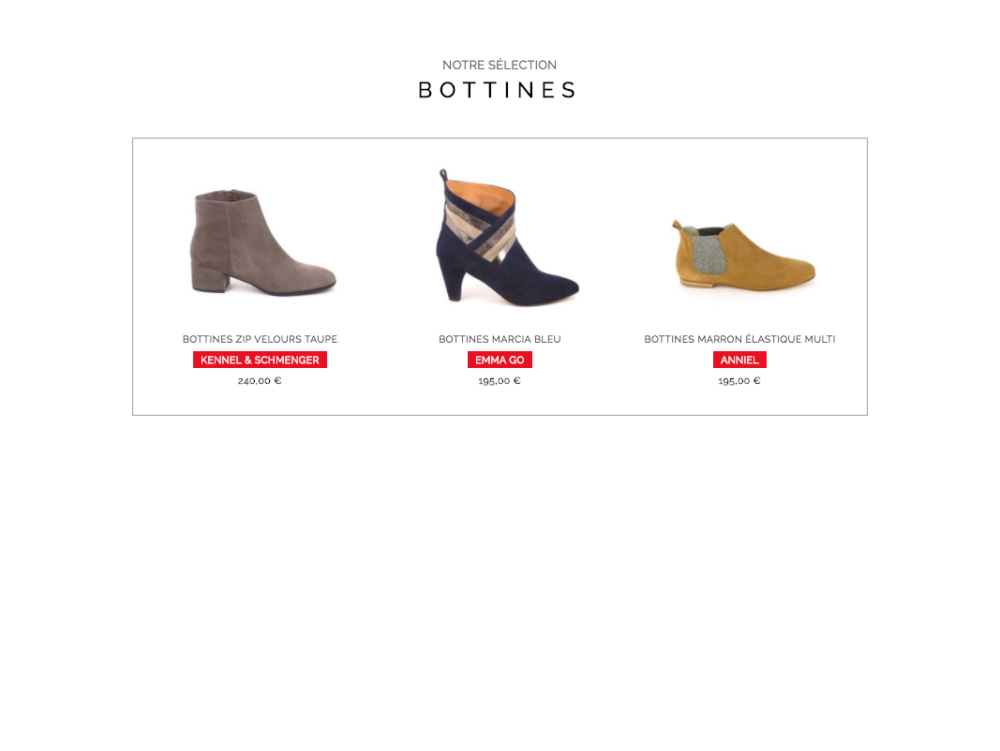

# Intégration Boutique

## Objectif
Réaliser l'intégration de la page 'sélection' d'une boutique.

## Instructions

- Réaliser l'intégration comme présentée dans le fichier `rendu/rendu-selection.png`
- Au survol de chaque produit, un cadre gris de 1px doit apparaître autour
- Chaque produit est un lien vers une future page produit
- L'étiquette `soldes` doit se trouver exactement au centre de l'écran, quelque soit la hauteur de la fenêtre
- La font utilisée est `Raleway`, elle est disponible sur [Google Fonts](https://fonts.google.com/).

## toDo
- réaliser l'intégration de la page d'un article
- réaliser l'intégration du menu